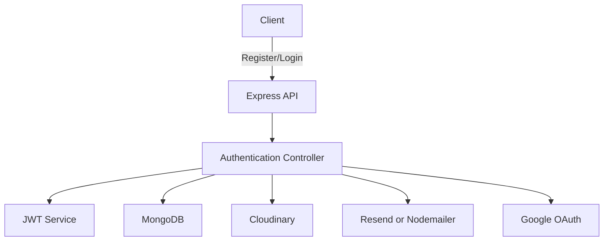

# MERN Auth API Template

<p align="center">
  <em>A production-ready authentication API template for MERN applications with JWT, Refresh Tokens, Email Verification, Google OAuth, Cloudinary uploads, and Password Recovery.</em>
</p>

<p align="center">
  
  
  
  
  
  
  
  
  
</p>

<p align="center">
  
</p>

---

## About

**MERN Auth API Template** is an open-source backend starter designed to eliminate repetitive authentication setup across projects.

Instead of rebuilding authentication from scratch every time, simply clone this repository, configure a few environment variables, and start building your application.

This template follows a modular architecture using Express, MongoDB, JWT, Cloudinary, Resend, and Google OAuth.

---

#  Features

| Feature | Status |
|----------|--------|
| User Registration | ✅ |
| Login / Logout | ✅ |
| JWT Authentication | ✅ |
| Refresh Token Rotation | ✅ |
| Secure HTTP-only Cookies | ✅ |
| Email Verification | ✅ |
| Forgot Password | ✅ |
| Reset Password | ✅ |
| Google OAuth Login | ✅ |
| Avatar Upload (Cloudinary) | ✅ |
| Update Profile | ✅ |
| Change Password | ✅ |
| Delete Account | ✅ |
| Modular Service Architecture | ✅ |

---

# 🛠Tech Stack

| Layer | Technology |
|--------|------------|
| Runtime | Node.js |
| Framework | Express.js |
| Database | MongoDB + Mongoose |
| Authentication | JWT |
| Password Hashing | bcrypt |
| File Upload | Multer |
| Image Storage | Cloudinary |
| Email Service | Resend and nodemailer |
| OAuth | Google OAuth |
| Environment | dotenv |

---

# Project Architecture



---

 📂 Project Structure

```text
mern-auth-api-template

│

├── backend
│   ├── public
│   ├── src
│   │   ├── controllers
│   │   ├── db
│   │   ├── middlewares
│   │   ├── models
│   │   ├── routes
│   │   ├── services
│   │   └── utils
│   │
│   ├── .env.sample
│   └── package.json
│
├── postman
│   └── MERN Auth API.postman_collection.json
│
└── README.md
```
---

#  Authentication Flow

## Registration

```text
User

↓

Register

↓

Upload Avatar

↓

Cloudinary

↓

Store User

↓

Generate Verification Token

↓

Send Email

↓

Verify Email

↓

Login
```

---

## Login

```text
User

↓

Validate Credentials

↓

Generate Access Token

↓

Generate Refresh Token

↓

Store Refresh Token

↓

Send HTTP-only Cookies
```

---

## Password Recovery

```text
Forgot Password

↓

Generate Reset Token

↓

Email User

↓

Reset Password

↓

Invalidate Token
```

---

#  Environment Variables

Create a `.env` file.

```env
PORT=
MONGODB_URI=
CORS_ORIGIN=
ACCESS_TOKEN_SECRET=
ACCESS_TOKEN_EXPIRY=
REFRESH_TOKEN_SECRET=
REFRESH_TOKEN_EXPIRY=
CLOUDINARY_API_SECRET=
CLOUDINARY_API_KEY=
CLOUDINARY_CLOUD_NAME=
RESEND_API_KEY=
GOOGLE_CLIENT_ID=
EMAIL_USER=
EMAIL_PASS=
FRONTEND_URL=
```

---

#  Getting Started

## Clone

```bash
git clone https://github.com/Radhikagupta25/mern-auth-api-template.git
```

## Install

```bash
npm install
```

## Run

```bash
npm run dev
```

---

# API Collection

A complete Postman collection is included for testing every endpoint.

```
postman/
    mern-auth-api.postman_collection.json
```

Included requests:

### Authentication

- Register
- Verify Email
- Login
- Logout
- Refresh Token
- Google Login

### User

- Get Current User
- Update User Details
- Update Avatar
- Change Password
- Delete Account
### Password Recovery

- Forgot Password
- Reset Password

---

#  API Endpoints

### Authentication

```
POST   /register

POST   /login

POST   /logout

POST   /refreshToken

GET    /verify-email/:token

POST   /google-login
```

### User

```
GET     /userDetails

PATCH   /changePassword

PATCH   /updateUserDetails

PATCH   /updateImageFiles

DELETE  /deleteAccount
```

### Password Recovery

```
POST   /forgotPassword

POST   /resetPassword/:token
```

---

#  Why this Template?

✔ Modular Architecture

✔ Production-ready Authentication

✔ Secure Token Rotation

✔ Cloudinary Integration

✔ Email Verification

✔ Google OAuth

✔ Password Recovery

✔ Easy to Extend

---

# 🤝 Contributing

Contributions are always welcome!

If you'd like to improve this project:

1. Fork the repository

2. Create a feature branch

```bash
git checkout -b feature/your-feature
```

3. Commit your changes

```bash
git commit -m "feat: add your feature"
```

4. Push your branch

```bash
git push origin feature/your-feature
```

5. Open a Pull Request 

Whether it's fixing a bug, improving documentation, or adding a feature, every contribution is appreciated.

---

#  Before Opening a Pull Request

- [ ] Project builds successfully
- [ ] Code follows existing style
- [ ] No sensitive information committed
- [ ] Environment variables documented
- [ ] Tested locally

---

#  Roadmap

- [ ] Swagger Documentation
- [ ] Role-based Authorization
- [ ] Session Management
- [ ] Docker Support
- [ ] GitHub OAuth
- [ ] Unit Testing
- [ ] CI/CD Pipeline

---

# 📄 License

This project is licensed under the MIT License.

---

#  Support

If you found this project useful:

⭐ Star the repository

🍴 Fork it

🐞 Open Issues

🚀 Submit Pull Requests

---

<p align="center">

Built with ❤️ by <b>Radhika Gupta</b>

If this template saved you time, consider giving it a ⭐ on GitHub.

</p>
